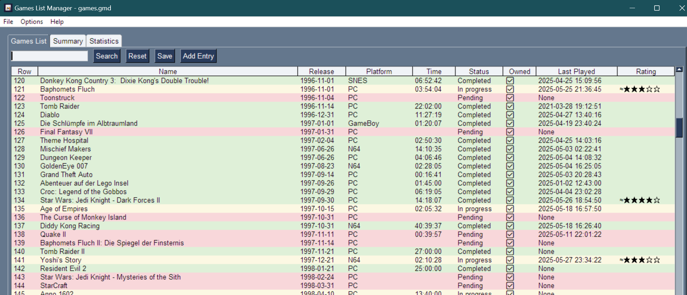
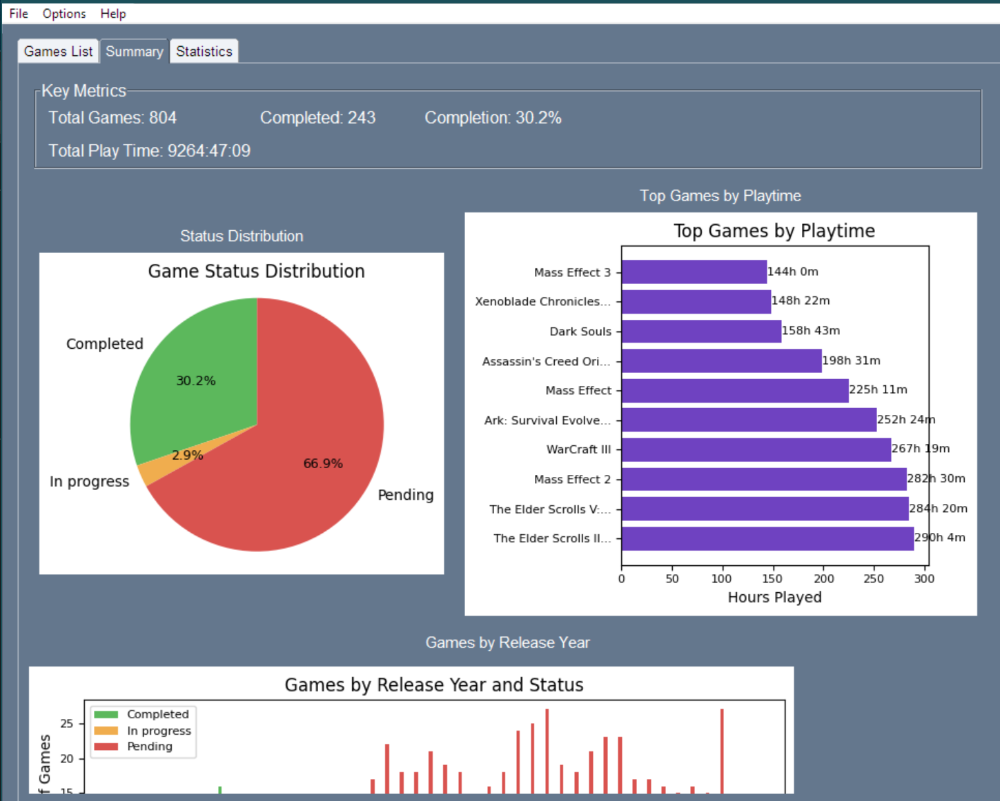
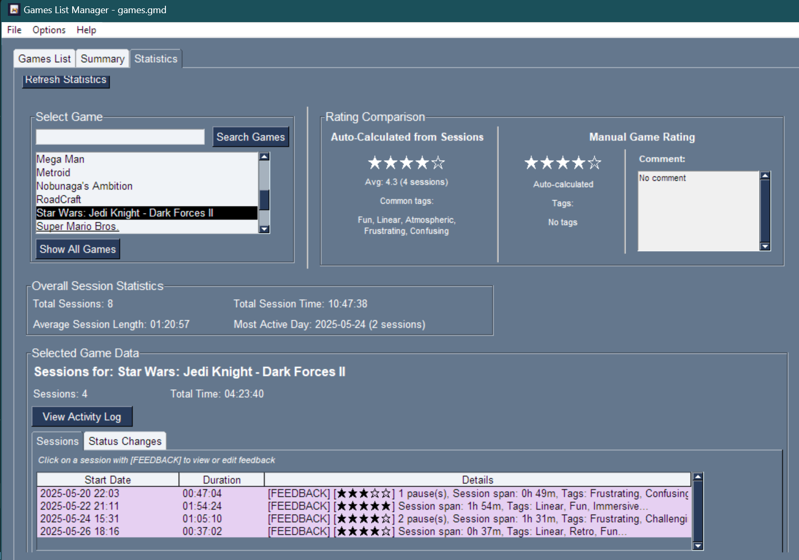
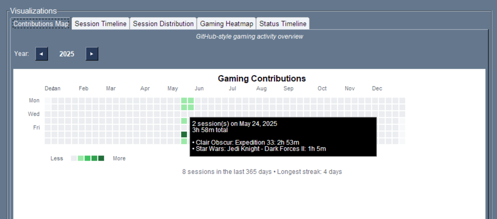
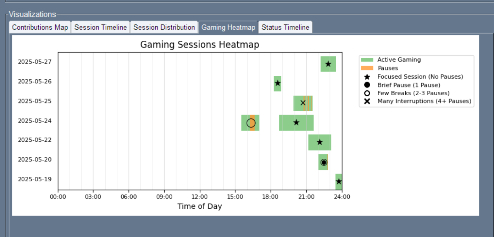
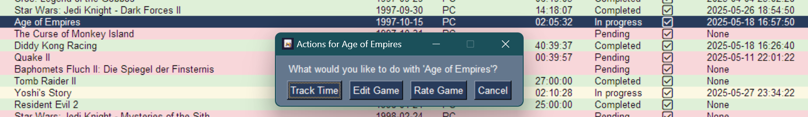

# GamesList Manager


## Table of Contents
- [Overview](#overview)
- [Features](#features)
- [Screenshots](#screenshots)
- [System Requirements](#system-requirements)
- [Installation](#installation)
- [Build From Source](#build-from-source)
- [Running the Application](#running-the-application)
- [Building Executable with cx_Freeze](#building-executable-with-cx_freeze)
- [File Formats](#file-formats)
- [Project Structure](#project-structure)
- [Quick Start Guide](#quick-start-guide)
- [Troubleshooting](#troubleshooting)
- [Contributing](#contributing)
- [License](#license)
- [Version History](#version-history)

## Overview

GamesList Manager is a comprehensive desktop application for managing your video game collection and tracking your gaming sessions. Built with Python and PySimpleGUI, it provides powerful features for organizing games, tracking playtime, rating experiences, and analyzing your gaming habits.

## Features

### 🎮 **Game Collection Management**
- Add, edit, and organize your game library
- Track ownership status, platforms, and release dates
- Color-coded status system (Pending, In Progress, Completed, etc.)
- Search and filter capabilities
- Excel import support for existing game lists

### ⏱️ **Advanced Time Tracking**
- Built-in session timer with play/pause/stop controls
- Automatic time tracking and session recording
- Detailed session history with timestamps
- Session feedback system with notes and ratings

### 🌟 **Dual Rating System**
- Rate individual gaming sessions (1-5 stars)
- Rate games overall with comprehensive feedback
- 50+ predefined tags for categorizing experiences
- Custom comments and detailed feedback
- Rating analysis and comparison tools

### 📊 **Rich Data Visualization**
- Status distribution pie charts
- Games by release year analysis
- Playtime distribution graphs
- Rating trends and analysis
- Gaming heatmap showing daily patterns
- Session timeline visualization

### 📈 **Statistics & Analytics**
- Comprehensive gaming statistics
- Session analysis and trends
- Status change timeline
- Tag frequency analysis
- Gaming habit insights

## Screenshots

### Main Interface - Games List

*Comprehensive game library with sortable columns, color-coded status, ratings, and search functionality*

### Summary Dashboard

*Visual analytics including status distribution, top games by playtime, and release year analysis*

### Advanced Statistics & Analytics

*Detailed game analysis with rating comparisons, session tracking, and comprehensive statistics*

### Gaming Activity Visualizations

*GitHub-style gaming activity heatmap showing daily gaming patterns throughout the year*


*Time-based gaming sessions heatmap revealing optimal gaming hours and session patterns*

### Interactive Features

*Context-sensitive game actions including time tracking, editing, and rating capabilities*

## System Requirements

- **Operating System**: Windows, macOS, or Linux
- **Python**: 3.7 or higher
- **Memory**: 512MB RAM minimum
- **Storage**: 50MB available space

**Note**: This application has been primarily developed and tested on Windows. macOS and Linux compatibility has not been thoroughly tested and may require additional configuration or adjustments.

## Installation

### 📦 **Quick Installation (Recommended)**

For most users, the easiest way to get started is to download the pre-built application:

1. **Download**: Go to the [Releases section](https://github.com/DrNefarius/GameTracker/releases/) of this GitHub repository
2. **Extract**: Download the latest release zip file and extract it to a folder of your choice
3. **Run**: Launch the application by running the included `GameTracker.exe` file (Windows)

**That's it!** No additional setup, Python installation, or dependency management required.

### 🔧 **Advanced Installation (Build from Source)**

If you prefer to build from source or are using macOS/Linux, see the [Build From Source](#build-from-source) section below for detailed instructions.

## Build From Source

### Important Note: PySimpleGUI Availability
⚠️ **Critical Information**: The required PySimpleGUI version (4.60.5) is **no longer officially available** from the original developers. PySimpleGUI moved to a licensed model for versions 5+ and removed all free older versions from official distribution channels.

**You will need to use a community fork to run this application:**
- **Recommended Source**: [https://github.com/markreading/PySimpleGUI_4_60_5](https://github.com/markreading/PySimpleGUI_4_60_5)
- This repository contains PySimpleGUI version 4.60.5, which was used in the development of this application
- Version 4.60.5 was one of the last free versions before the licensing changes

### 1. Clone or Download the Project
```bash
git clone <repository-url>
cd GamesList
```

### 2. Set Up Python Environment (Recommended)
```bash
# Create virtual environment
python -m venv .venv

# Activate virtual environment
# On Windows:
.venv\Scripts\activate
# On macOS/Linux:
source .venv/bin/activate
```

### 3. Install PySimpleGUI from Community Fork
Since PySimpleGUI 4.60.5 is no longer officially available, you have two options:

#### Option A: Manual Installation (Recommended)
1. Download or clone the PySimpleGUI fork: [https://github.com/markreading/PySimpleGUI_4_60_5](https://github.com/markreading/PySimpleGUI_4_60_5)
2. Copy the `PySimpleGUI` folder to your project directory, or
3. Install it to your Python site-packages directory:
   - **Windows**: `AppData/Local/Programs/Python/Python3XX/Lib/site-packages`
   - **macOS/Linux**: Check your Python installation's site-packages location

#### Option B: Install Other Dependencies First
```bash
# Install all other dependencies except PySimpleGUI
pip install matplotlib>=3.5.0 openpyxl>=3.0.0 Pillow>=9.0.0
```
Then follow Option A for PySimpleGUI installation.

### 4. Install Remaining Dependencies
```bash
pip install -r requirements.txt
```
*Note: This may fail for PySimpleGUI if using the standard requirements.txt. Follow the PySimpleGUI community fork installation above.*

### Required Dependencies:
- **PySimpleGUI** (4.60.0+, <5.0.0) - ⚠️ **Must use community fork** - GUI framework
- **matplotlib** (3.5.0+) - Data visualization  
- **openpyxl** (3.0.0+) - Excel file support
- **Pillow** (9.0.0+) - Image processing for emoji rendering

## Running the Application

### Development Mode
```bash
python main.py
```

### First Launch
- The application will create a default `games.gmd` file in your home directory
- Configuration files are stored in platform-specific locations:
  - **Windows**: `%APPDATA%\GamesListManager\`
  - **macOS**: `~/Library/Application Support/GamesListManager/`
  - **Linux**: `~/.config/GamesListManager/`

## Building Executable with cx_Freeze

### 1. Install cx_Freeze
```bash
pip install cx_Freeze
```

### 2. Build the Executable
```bash
python setup.py build
```

### 3. Locate the Built Application
The executable will be created in:
```
build/exe.[platform]-[python_version]/
```

### Build Configuration Details
The `setup.py` file configures:
- **Entry Point**: `main.py`
- **Executable Name**: `GameTracker.exe` (Windows) or `GameTracker` (Unix)
- **Version**: Automatically set from `constants.py`
- **Icon**: `gameslisticon.ico`
- **Dependencies**: Automatically detected
- **Included Files**: Application icon

### Platform-Specific Build Notes

**⚠️ Important**: Building and running on macOS and Linux has not been thoroughly tested. The instructions below are provided for reference, but may require additional troubleshooting and platform-specific adjustments.

#### Windows (Tested)
```bash
python setup.py build
# Output: build/exe.win-amd64-[python_version]/GameTracker.exe
```

#### macOS (Not Tested)
```bash
python setup.py build
# Output: build/exe.macosx-[version]-[python_version]/GameTracker
```

#### Linux (Not Tested)
```bash
python setup.py build
# Output: build/exe.linux-[arch]-[python_version]/GameTracker
```

## File Formats

### .GMD Files (Primary Format)
- JSON-based Games Manager Data format
- Contains all game data, sessions, ratings, and history
- Human-readable and backup-friendly
- Automatic versioning for future compatibility

### Excel Import (.xlsx)
- Import existing game lists from Excel spreadsheets
- Expected columns: Name, Release Date, Platform, Time, Status, Owned, Last Played
- Automatically converts to .gmd format after import

## Project Structure

### Core Modules
- **`main.py`** - Main entry point and event loop
- **`constants.py`** - Application constants and configuration
- **`config.py`** - Configuration management
- **`data_management.py`** - File I/O operations (GMD, Excel import/export)
- **`utilities.py`** - Helper functions and data formatting
- **`ratings.py`** - Game and session rating functionality
- **`game_statistics.py`** - Statistical calculations and summaries

### UI and Interaction Modules  
- **`ui_components.py`** - UI layout creation and component management
- **`event_handlers.py`** - Event processing and user interaction handling
- **`session_management.py`** - Session tracking, time management, and notes
- **`visualizations.py`** - Chart generation and matplotlib integration
- **`emoji_utils.py`** - Emoji rendering and image handling

### Additional Files
- **`setup.py`** - cx_Freeze build configuration
- **`requirements.txt`** - Python dependencies
- **`gameslisticon.ico`** - Application icon

## Quick Start Guide

1. **Add Your First Game**: Click "Add Entry" and fill in game details
2. **Track Gaming Time**: Click on a game → "Track Time" → Use play/pause/stop controls
3. **Rate Your Experience**: Add session feedback with ratings, tags, and notes
4. **Explore Analytics**: Check the Summary and Statistics tabs for insights
5. **Organize Your Collection**: Use search, filters, and sorting to manage your library

## Troubleshooting

### Common Issues

#### Import Errors
- Ensure all dependencies are installed: `pip install -r requirements.txt`
- Check Python version compatibility (3.7+)

#### Build Issues
- Verify cx_Freeze is installed: `pip install cx_Freeze`
- Ensure `gameslisticon.ico` is in the project directory
- Check for missing dependencies in the build output

#### Data Issues  
- .gmd files are JSON format - can be opened in text editor for manual recovery
- Backup files regularly using "Save As" feature
- Check file permissions in save directory

### Getting Help
- **Discord**: @drnefarius for bug reports and feature requests
- **GitHub Issues**: Open an issue in the project repository for bug reports, feature requests, and technical support
- **GitHub**: Check for known issues and solutions
- **Data Recovery**: .gmd files are human-readable JSON for manual recovery

## Contributing

We welcome contributions! Please:
- Report bugs via Discord (@drnefarius) or GitHub issues
- Suggest features and improvements via GitHub issues
- Share your gaming insights with the community
- Contribute to documentation and code

## License

This project is licensed under the terms included with the distribution.

## Version History

### v1.5 (Current)
- ✅ **Enhanced Rating System**: Dual ratings with tags and comments
- ✅ **Advanced Analytics**: Gaming heatmaps and session analysis
- ✅ **Unified Feedback**: Combined notes and ratings system
- ✅ **Improved Visualizations**: Interactive charts and statistics
- ✅ **Better Data Management**: Automatic migration and backup features

### Previous Versions
- v1.1: Core functionality with basic game tracking and time management

---

**Built with ❤️ using Python, PySimpleGUI, and matplotlib**
