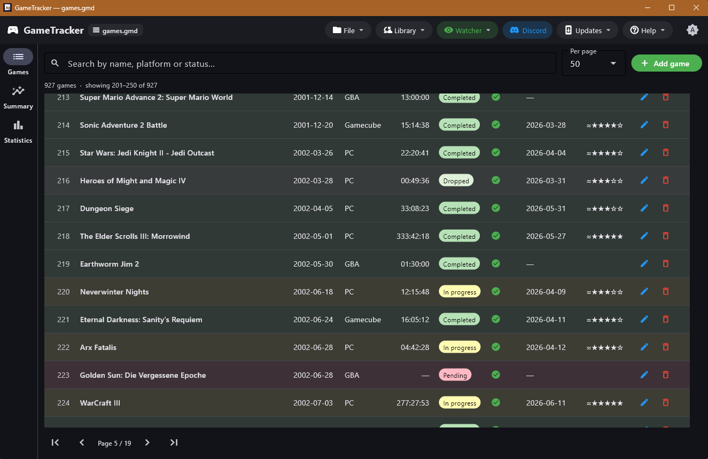
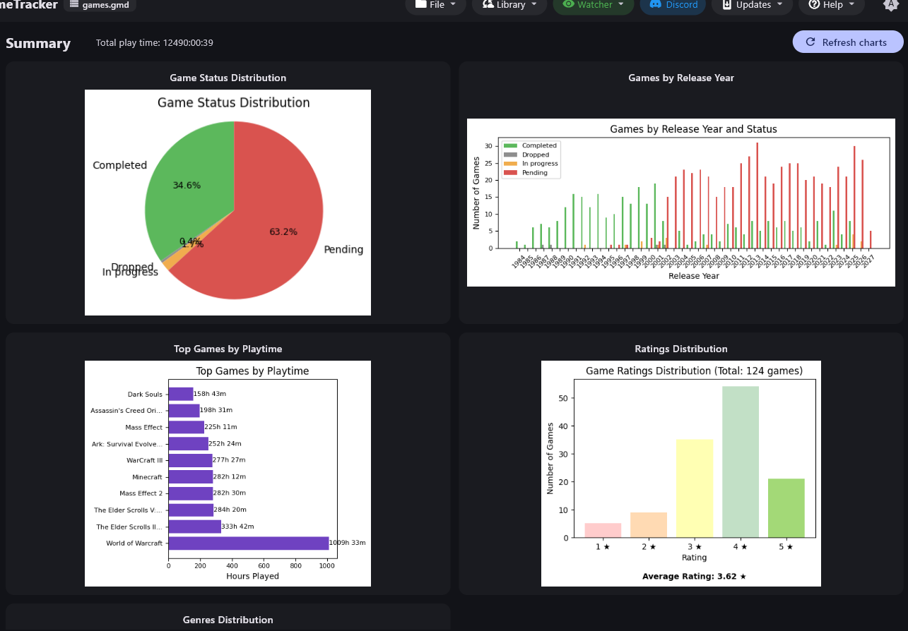
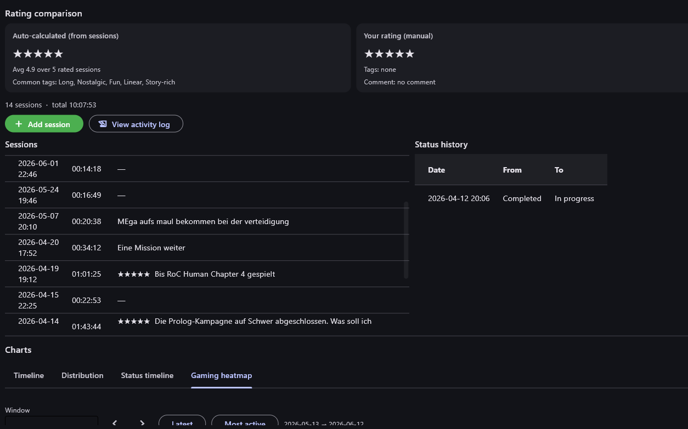
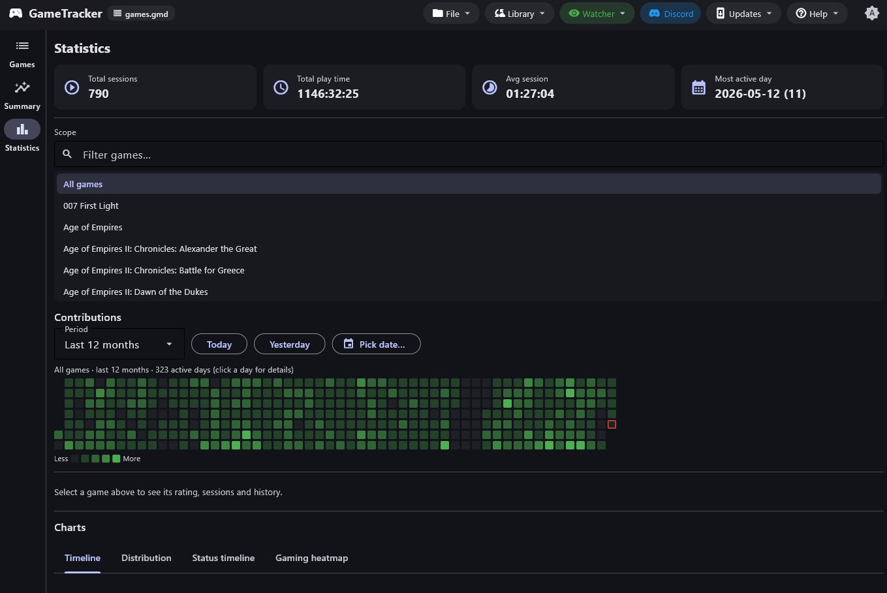
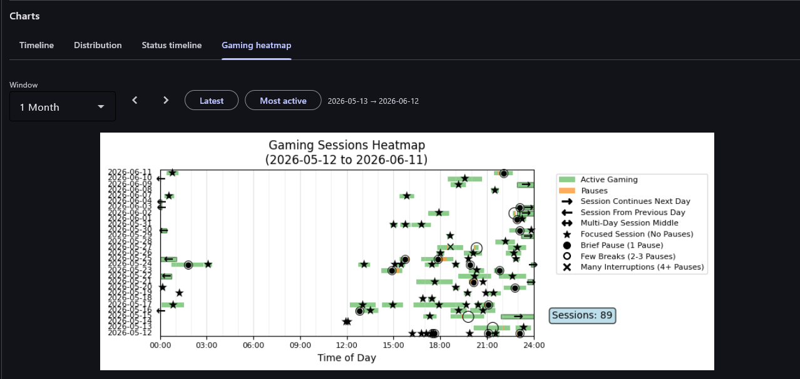
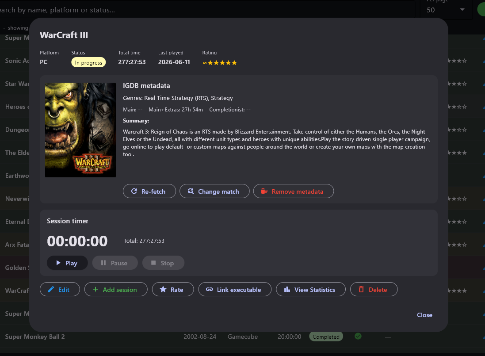

# GamesList Manager


## Table of Contents
- [Overview](#overview)
- [Features](#features)
- [Screenshots](#screenshots)
- [System Requirements](#system-requirements)
- [Installation](#installation)
- [Build From Source](#build-from-source)
- [Running the Application](#running-the-application)
- [Building a Native Executable](#building-a-native-executable)
- [File Formats](#file-formats)
- [Quick Start Guide](#quick-start-guide)
- [Troubleshooting](#troubleshooting)
- [Contributing](#contributing)
- [License](#license)

## Overview

GamesList Manager is a comprehensive desktop application for managing your video game collection and tracking your gaming sessions. Built with Python and Flet (Flutter), it provides powerful features for organizing games, tracking playtime, rating experiences, and analyzing your gaming habits.

## Features

### 🎮 **Game Collection Management**
- Add, edit, and organize your game library
- Track ownership status, platforms, and release dates
- Color-coded status system (Pending, In Progress, Completed, etc.)
- Search and filter capabilities
- Excel import support for existing game lists

### ⏱️ **Advanced Time Tracking**
- Built-in session timer with play/pause/stop controls
- Automatic time tracking and session recording
- Detailed session history with timestamps
- Session feedback system with notes and ratings

### 🛰️ **Auto Session Tracking (Windows Process Watcher)**
- Detects when a known game launches and records the session automatically
- Layered matcher: learned mappings → Steam / Epic / GOG manifests → fuzzy match
- OS-native Windows toast notifications on session start / end with cover art
- System-tray icon with pause / resume / stop controls and console-game shortcuts
- Idle pause and foreground-only modes with quiet-hours support
- Crash-safe: partial sessions are recovered on restart
- See [docs/PROCESS_WATCHER.md](docs/PROCESS_WATCHER.md) for details

### 🌟 **Dual Rating System**
- Rate individual gaming sessions (1-5 stars)
- Rate games overall with comprehensive feedback
- 50+ predefined tags for categorizing experiences
- Custom comments and detailed feedback
- Rating analysis and comparison tools

### 📊 **Rich Data Visualization**
- Status distribution pie charts
- Games by release year analysis
- Playtime distribution graphs
- Rating trends and analysis
- Gaming heatmap showing daily patterns
- Session timeline visualization

### 📈 **Statistics & Analytics**
- Comprehensive gaming statistics
- Session analysis and trends
- Status change timeline
- Tag frequency analysis
- Gaming habit insights

### 🎨 **IGDB Metadata Integration**
- Fetch cover art, genres, summaries, aggregated critic ratings, and average completion times from IGDB
- Per-game **View Details** popup showing cover, genres, summary, and your progress versus the "Main Story" average
- One-click **Enrich Library from IGDB** to auto-match your whole collection
- Credentials stored locally; see [IGDB_SETUP.md](docs/IGDB_SETUP.md) for setup

### 🎪 **Discord Rich Presence Integration**
- Real-time Discord status updates showing current activity
- Dynamic status for playing games, browsing library, viewing stats
- Session tracking with elapsed time display
- Library statistics in Discord status
- Customizable presence messages and branding
- Easy setup with your own Discord application

## Screenshots

### Main Interface - Games List

*Comprehensive game library with sortable columns, color-coded status, ratings, and search functionality*

### Summary Dashboard

*Visual analytics including status distribution, top games by playtime, and release year analysis*

### Advanced Statistics & Analytics

*Detailed game analysis with rating comparisons, session tracking, and comprehensive statistics*

### Gaming Activity Visualizations

*GitHub-style gaming activity heatmap showing daily gaming patterns throughout the year*


*Time-based gaming sessions heatmap revealing optimal gaming hours and session patterns*

### Interactive Features

*Context-sensitive game actions including time tracking, editing, and rating capabilities*

## System Requirements

- **Operating System**: Windows, macOS, or Linux
- **Python**: 3.10 or higher (only to build from source — the packaged release bundles its own runtime)
- **Memory**: 512MB RAM minimum
- **Storage**: 50MB available space

**Note**: This application has been primarily developed and tested on Windows. macOS and Linux compatibility has not been thoroughly tested and may require additional configuration or adjustments.

## Installation

### 📦 **Quick Installation (Recommended)**

For most users, the easiest way to get started is to download the pre-built application:

1. **Download**: Go to the [Releases section](https://github.com/DrNefarius/GameTracker/releases/) of this GitHub repository
2. **Extract**: Download the latest release zip file and extract it to a folder of your choice
3. **Run**: Launch the application by running the included `GameTracker.exe` file (Windows)

**That's it!** No additional setup, Python installation, or dependency management required.

> **Windows blocking the first launch?** GameTracker isn't signed with a paid Microsoft certificate, so SmartScreen / Smart App Control may flag it as an unknown publisher — see [Troubleshooting](#troubleshooting) for how to allow it.

### 🔧 **Advanced Installation (Build from Source)**

If you prefer to build from source or are using macOS/Linux, see the [Build From Source](#build-from-source) section below for detailed instructions.

## Build From Source

### 1. Clone or Download the Project
```bash
git clone <repository-url>
cd GamesList
```

### 2. Set Up a Python Environment (Recommended)
```bash
# Create virtual environment (Python 3.10+)
python -m venv .venv

# Activate virtual environment
# On Windows:
.venv\Scripts\activate
# On macOS/Linux:
source .venv/bin/activate
```

### 3. Install Dependencies
```bash
pip install -r requirements.txt
```

### Required Dependencies:
- **flet** (0.85.x) - GUI framework (Flutter-based)
- **flet-desktop** (0.85.x) - native desktop window for `flet run` / `python app_flet.py`
- **matplotlib** (3.5.0+) - Data visualization
- **openpyxl** (3.0.0+) - Excel file support
- **Pillow** (9.0.0+) - Image processing (cover art and other in-app images)
- **pypresence**, **psutil**, **rapidfuzz**, **pystray**, and (Windows) **windows-toasts** - Discord Rich Presence, process watcher, fuzzy matching, system-tray icon, and toast notifications

## Running the Application

### Development Mode
```bash
python app_flet.py
```

### First Launch
- The application will create a default `games.gmd` file in your home directory
- Configuration files are stored in platform-specific locations:
  - **Windows**: `%APPDATA%\GamesListManager\`
  - **macOS**: `~/Library/Application Support/GamesListManager/`
  - **Linux**: `~/.config/GamesListManager/`

### Discord Rich Presence Setup (Optional)
Want to show your gaming library management activity on Discord? See [DISCORD_SETUP.md](docs/DISCORD_SETUP.md) for detailed instructions on setting up Discord Rich Presence integration.

## Building a Native Executable

The packaged app is built with **Flet** (`flet build`), which bundles an embedded
Python runtime — no separate Python install is needed on the target machine.

```bash
# Windows (tested)
scripts/build_windows.ps1   # -> build/windows/GameTracker.exe

# Linux (run on a Linux host — no cross-compile)
scripts/build_linux.sh
```

The build is configured under `[tool.flet.app]` in `pyproject.toml`
(`module = "app_flet"` so the Flet entry point is packaged, not a legacy `main`).
The full guide — prerequisites (Flutter SDK on PATH, plus the platform C/C++
toolchain), configuration, and a detailed troubleshooting section — lives in
**[docs/BUILD.md](docs/BUILD.md)**.

## File Formats

### .GMD Files (Primary Format)
- JSON-based Games Manager Data format
- Contains all game data, sessions, ratings, and history
- Human-readable and backup-friendly
- Automatic versioning for future compatibility

### Excel Import (.xlsx)
- Import existing game lists from Excel spreadsheets
- Expected columns: Name, Release Date, Platform, Time, Status, Owned, Last Played
- Automatically converts to .gmd format after import

## Quick Start Guide

1. **Add Your First Game**: Click "Add Entry" and fill in game details
2. **Track Gaming Time**: Click on a game → "Track Time" → Use play/pause/stop controls
3. **Rate Your Experience**: Add session feedback with ratings, tags, and notes
4. **Explore Analytics**: Check the Summary and Statistics tabs for insights
5. **Organize Your Collection**: Use search, filters, and sorting to manage your library

## Troubleshooting

### Common Issues

#### Windows won't let the app start (SmartScreen / Smart App Control)
GameTracker isn't signed with a paid Microsoft certificate, so Windows may block it on first launch as coming from an "unknown publisher." This is a false positive — the app is open source.
- **SmartScreen** ("Windows protected your PC"): click **More info → Run anyway**.
- **Smart App Control** (Windows 11) is stricter and may block unsigned apps outright, with no "Run anyway" prompt. Either right-click `GameTracker.exe` → **Properties → Unblock**, or turn Smart App Control off under **Windows Security → App & browser control → Smart App Control settings**.

#### Import Errors
- Ensure all dependencies are installed: `pip install -r requirements.txt`
- Check Python version compatibility (3.10+)

#### Build Issues
- See **[docs/BUILD.md](docs/BUILD.md)** for the Flet build prerequisites and a
  detailed troubleshooting section.
- Ensure the Flutter SDK is on PATH (`flet build` can auto-download it on first run).

#### Data Issues  
- .gmd files are JSON format - can be opened in text editor for manual recovery
- Backup files regularly using "Save As" feature
- Check file permissions in save directory

### Getting Help
- **Discord**: @drnefarius for bug reports and feature requests
- **GitHub Issues**: Open an issue in the project repository for bug reports, feature requests, and technical support
- **GitHub**: Check for known issues and solutions
- **Data Recovery**: .gmd files are human-readable JSON for manual recovery

## Contributing

We welcome contributions! Please:
- Report bugs via Discord (@drnefarius) or GitHub issues
- Suggest features and improvements via GitHub issues
- Share your gaming insights with the community
- Contribute to documentation and code

## License

This project is licensed under the terms included with the distribution.

---

**Built with ❤️ using Python, Flet, and matplotlib**
